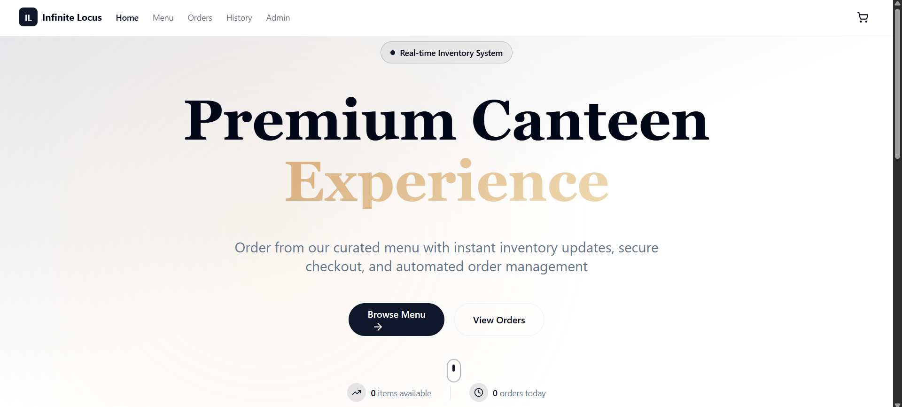
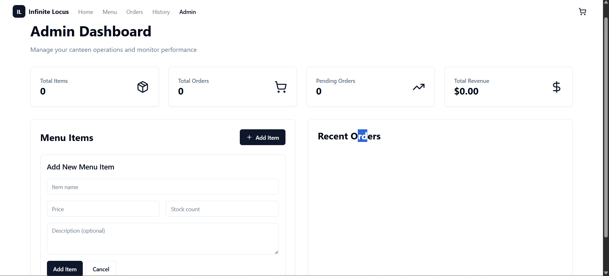

# 🍽️ Canteen Ordering System — Full-Stack (Spring Boot + React + Docker)

> A production-grade **Canteen Ordering System** built as part of the **Infinite Locus Assessment**.  
> Demonstrates full-stack engineering depth — backend transactional safety with inventory locking, auto-cancellation scheduler, clean React + Tailwind frontend, and Docker support.

---

## 🚀 Demo

### 🖥️ Application Preview

|  |  |
|:--------------------------------:|:---------------------------------:|
| *Home Page View* | *Admin Dashboard View* |

> **Home Page:** Real-time inventory system showing live stock count, order history, admin controls, and a curated menu for quick ordering.

---

## 🧩 Overview

The **Canteen Ordering System** is a full-stack web application that simplifies the canteen experience for students, employees, and administrators.

### 👤 Users can:
- Browse menu items, view availability, and place instant orders.  
- Track live order status and view previous orders.

### 🛠️ Admins can:
- Manage menu items (add/update/delete).  
- Control stock quantity and availability.  
- View all customer orders and auto-cancel stale ones.

### ⚙️ Backend ensures:
- Transaction-safe inventory updates using **pessimistic locking**.  
- Scheduled background jobs for automatic order cleanup.  
- RESTful API design for frontend consumption.

### 💻 Frontend ensures:
- A sleek, responsive, real-time experience using **React + TailwindCSS**.  
- Instant cart updates and persistent session data via **Zustand**.

---

## 🛠️ Tech Stack

### **Backend**
- **Java 11+**, **Spring Boot 2.7.18**
- Spring Data JPA (Hibernate ORM)
- MySQL (Production) / H2 (Development)
- Swagger UI for API Documentation
- Maven build system
- JUnit + Mockito for testing

### **Frontend**
- **React 18** with **Vite**
- TailwindCSS for styling
- Zustand for global state management (cart persistence)
- Axios for REST API integration
- Sonner for modern toast notifications

### **DevOps**
- Docker & Docker Compose
- Nginx for serving production build
- Environment-based configurations for easy deployment

---

## ⚡ Quick Start (3 Ways)

### **1. Simplest (Windows)**
Just double-click:
```bash
START.bat


### **2. Using Docker (Recommended)**

# Clone the repository
git clone https://github.com/yourusername/canteen-ordering-system.git
cd canteen-ordering-system

# Build and start containers
docker-compose up --build


Now open:

Frontend → http://localhost:3000  
Backend → http://localhost:8080  
Swagger UI → http://localhost:8080/swagger-ui/

## 🔧 **Manual Setup (If Needed)**

### **Backend:**
```bash
# Set Java environment
set JAVA_HOME=C:\Program Files\Java\jdk-24
set PATH=%JAVA_HOME%\bin;%PATH%

# Navigate to backend
cd Backend

# Start Spring Boot
mvnw.cmd spring-boot:run
```

### **Frontend:**
```bash
# Navigate to frontend
cd Frontend

# Install dependencies
npm install

# Start development server
npm run dev
```

**That's it!** The application will:
- ✅ Set up Java environment automatically
- ✅ Start the backend server
- ✅ Install frontend dependencies
- ✅ Start the frontend server
- ✅ Open the application in browser

---

## 📁 Folder Structure

```bash
Canteen-Ordering-System/
│
├── Backend/
│   ├── src/
│   │   ├── main/java/com/canteen/
│   │   │   ├── controller/        # REST Controllers
│   │   │   ├── service/           # Business Logic Layer
│   │   │   ├── repository/        # JPA Repositories
│   │   │   ├── model/             # Entity Classes
│   │   │   └── scheduler/         # Scheduled Tasks (auto-cancel)
│   │   └── resources/
│   │       ├── application.yml    # Environment config
│   │       └── data.sql           # Seed Data
│   ├── pom.xml
│   └── Dockerfile
│
├── Frontend/
│   ├── src/
│   │   ├── components/            # Reusable UI Components
│   │   ├── pages/                 # Page-level React Components
│   │   ├── store/                 # Zustand Store
│   │   ├── api/                   # Axios Service Modules
│   │   └── App.jsx
│   ├── public/
│   ├── package.json
│   └── Dockerfile
│
├── docker-compose.yml
├── START.bat
└── README.md


## 🌐 **Application URLs**

| Service | URL | Description |
|---------|-----|-------------|
| **🏠 Main App** | http://localhost:3000 | React.js frontend |
| **🔧 Backend API** | http://localhost:8080 | Spring Boot REST API |
| **📚 API Docs** | http://localhost:8080/swagger-ui.html | Swagger documentation |
| **🗄️ Database** | http://localhost:8080/h2-console | H2 Database console |

---

## 🎯 **Key Features**

### **Backend:**
- ✅ **RESTful APIs** with Spring Boot
- ✅ **Real-time inventory** management with pessimistic locking
- ✅ **Automated order cancellation** (15-minute timeout)
- ✅ **Transaction-safe** stock management
- ✅ **Swagger documentation** for API testing
- ✅ **H2 in-memory database** for development

### **Frontend:**
- ✅ **React.js** with modern hooks and functional components
- ✅ **Responsive design** with TailwindCSS
- ✅ **Real-time updates** (10-second polling)
- ✅ **Shopping cart** with quantity management
- ✅ **Order management** with countdown timers
- ✅ **Admin dashboard** for system management
- ✅ **Modern UI** with shadcn/ui components

---

## 🧪 **Testing the Application**

### **1. Backend API Test:**
```bash
curl http://localhost:8080/api/menu
# Should return JSON array of menu items
```

### **2. Frontend Test:**
1. Open http://localhost:3000
2. Browse menu items
3. Add items to cart
4. Create orders
5. Check order status

### **3. Full Integration Test:**
1. **Browse Menu** - View available items
2. **Add to Cart** - Add items to shopping cart
3. **Checkout** - Create orders
4. **View Orders** - Check order status with countdown timer
5. **Admin Panel** - Manage menu items and view statistics

---

## 🛠️ **Troubleshooting**

### **Java Issues:**
```bash
# Check Java version
java -version

# If not found, install Java 11+ from:
# https://www.oracle.com/java/technologies/downloads/
```

### **Node.js Issues:**
```bash
# Check Node.js version
node --version

# If not found, install from:
# https://nodejs.org/
```

### **Port Conflicts:**
- **Backend (8080):** Change in `Backend/src/main/resources/application.properties`
- **Frontend (3000):** Change in `Frontend/vite.config.js`

---

**🎊 Your Canteen Ordering System is ready to use! Just run `START.bat` and you're good to go!** 🚀
